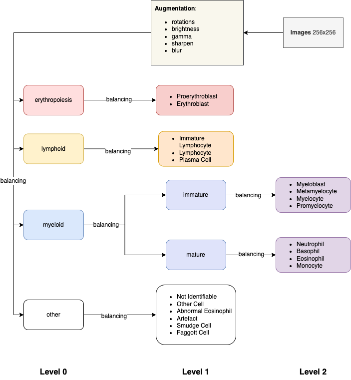

# blood-classifier

Blood and Bone Marrow classifier.



## Used DataSet


*Matek, C., Krappe, S., Münzenmayer, C., Haferlach, T., & Marr, C. (2021). An Expert-Annotated Dataset of Bone Marrow 
Cytology in Hematologic Malignancies [Data set]. The Cancer Imaging Archive.*
[https://doi.org/10.7937/TCIA.AXH3-T579](https://doi.org/10.7937/TCIA.AXH3-T579)


## Developer Usage

Run backend locally:

```docker-compose up ```

Run frontend locally:

just open in browser ```./frontend/uploader.js```.
